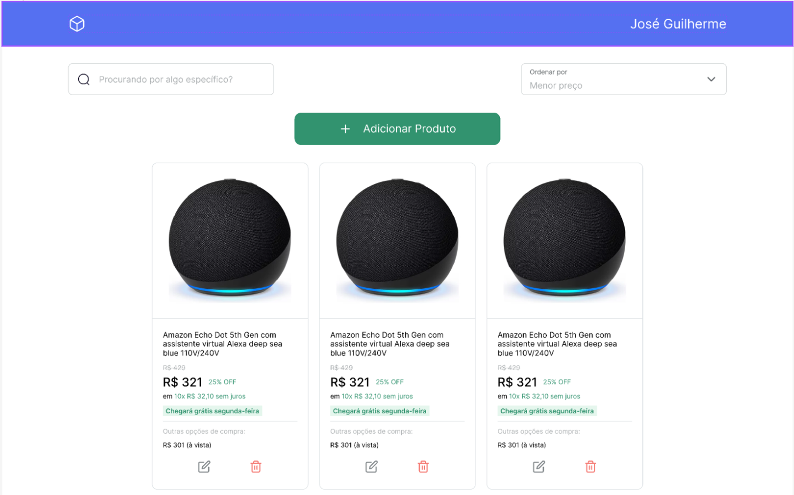

<h1 align="center">
  E-commerce product management
</h1>



<div align="center">
  <a href="README-en.md">English</a>
  ·
  <a href="README.md">Português</a>
</div>

## 💬 Description

This is an application that manages a list of products from a fictitious e-commerce aimed at training the main operations carried out on data in a web application. These operations are: creating, reading, updating and deleting information.

## 🚀 Technologies

### Front-end

- [ReactJS](https://react.dev/) - Library for building interfaces using components
- [TypeScript](https://www.typescriptlang.org/) - Set of packages that add static typing to the JavaScript language
- [Google Fonts](https://fonts.google.com/) - Library containing various fonts
- [Tailwind CSS](https://tailwindcss.com/) - CSS framework for styling
- [React Router](https://reactrouter.com/en/main) - Application route management
- [React-Toastify](https://www.npmjs.com/package/react-toastify) - Notifications display component
- [Formik](https://formik.org/) - Form Management Library
- [Yup](https://github.com/jquense/yup) - Library for schema and data validation

#### Layout

- You can view the project layout through [this link](https://www.figma.com/file/IohYm7tDAtTJFNl5ejls6R/Gerenciamento-de-E-commerce?type=design&node-id=0%3A1&mode=design&t=wHUPqJtMRDYErRoG-1)
- You can view the layout of the form components through [this link](https://www.figma.com/community/file/1148375559326132425)

### Back-end

- REST API generated by [Supabase](https://supabase.com/)

## 🚀 Getting started

First of all you need to have [Node](https://nodejs.org/) and [npm](https://www.npmjs.com/) installed on your machine.

Then you can clone the repository.

```code
  git clone https://github.com/zehguilherme/ecommerce-crud
```

Start the application

1. `cd web`
2. `npm install`
3. `npm run dev`

## 🤔 How to contribute

1. Fork the project;
2. Create your feature branch: `git checkout -b my-new-feature`;
3. Commit your changes: `git commit -m 'feat: Add some feature'`;
4. Push to the branch: `git push origin my-new-feature`;
5. Create a new Pull Request;
6. After the merge of your pull request is done, you can delete your branch.

---

Made with 💟 by José Guilherme Paro Monteiro Tomaine 👋 [Talk to me!](https://www.linkedin.com/in/josé-guilherme-paro-monteiro-tomaine/)