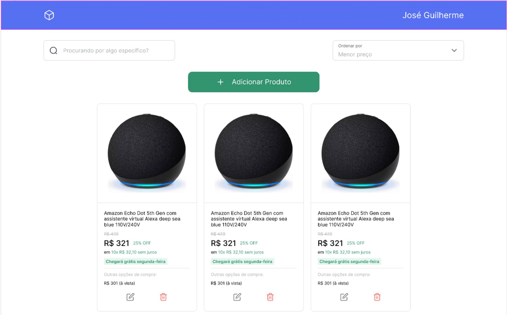

<h1 align="center">
  Gerenciamento de Produtos de um E-commerce
</h1>



<div align="center">
  <a href="README-en.md">English</a>
  ·
  <a href="README.md">Português</a>
</div>

## 💬 Descrição

Esta é uma aplicação que gerencia uma lista de produtos de um e-commerce fictício visando o aprendizado/treinamento das principais operações realizadas sobre dados em uma aplicação web. Essas operações são: criação, leitura, atualização e exclusão de informações.

## 🚀 Tecnologias

### Front-end

- [ReactJS](https://react.dev/) - Biblioteca para construção de interfaces usando componentes
- [TypeScript](https://www.typescriptlang.org/)
- [Google Fonts](https://fonts.google.com/)
- [TailwindCSS](https://tailwindcss.com/) - Framework CSS
- [React Router](https://reactrouter.com/en/main) - Gerenciamento de rotas da aplicação
- [React-Toastify](https://www.npmjs.com/package/react-toastify) - Componente de exibição de notificações
- [Formik](https://formik.org/) - Biblioteca de gerenciamento de formulários
- [Yup](https://github.com/jquense/yup) - Construtor de esqueleto de dados para análise e validação de valor em tempo de execução

#### Layout

- Você pode visualizar o layout do projeto através [deste link](https://www.figma.com/file/IohYm7tDAtTJFNl5ejls6R/Gerenciamento-de-E-commerce?type=design&node-id=0%3A1&mode=design&t=wHUPqJtMRDYErRoG-1)
- Você pode visualizar o layout dos componentes de formulário através [deste link](https://www.figma.com/community/file/1148375559326132425)

### Back-end

- API gerada via [Supabase](https://supabase.com/)

## 🚀 Começando

Primeiro de tudo você precisa ter `node` e `npm` (ou `yarn`) instalados em sua máquina.

*Se você decidir usar o yarn não se esqueça de deletar `package-lock.json` nas pastas.*

Então você pode clonar o repositório.

```code
  git clone https://github.com/zehguilherme/ecommerce-crud
```

Inicie a aplicação

1. `cd web`
2. `npm install` ou `yarn`
3. `npm run dev` ou `yarn dev`

## 🤔 Como contribuir

1. Faça um fork do projeto;
2. Crie uma branch com a sua feature: `git checkout -b minha-nova-feature`;
3. Faça commit das suas alterações: `git commit -m 'feat: Adição de uma nova feature'`;
4. Faça push para o branch: `git push origin minha-nova-feature`;
5. Crie uma nova Pull Request;
6. Depois que o merge de sua Pull Request for concluída, você pode excluir sua branch.

---

Feito com 💟 por José Guilherme Paro Monteiro Tomaine 👋 [Fale comigo!](https://www.linkedin.com/in/josé-guilherme-paro-monteiro-tomaine/)
